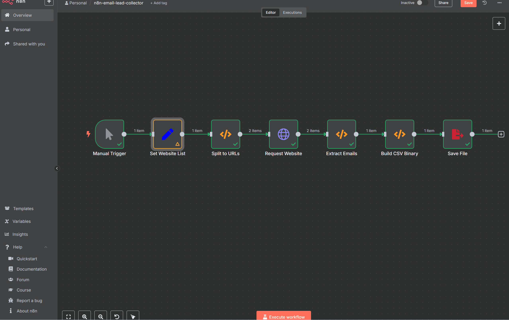

# 📧 Email Lead Collector (n8n)

This automation flow allows you to scrape emails from any list of websites and export the result as a downloadable CSV file.

✅ Built using official n8n nodes only  
✅ No OAuth / external API required  
✅ No community nodes used  

---

## 🧩 Features

- Input list of website URLs
- Scrape email addresses from HTML content
- Filter duplicate & invalid emails
- Export result as CSV to `./emails.csv`
- Works on n8n v1.94.1 and above

---

## 🚀 Usage (Step-by-step)

1. Import the provided `email-lead-collector.json` into n8n
2. Click the first node (Set) → enter websites in this format:

   ```json
   [
     "https://www.djangoproject.com",
     "https://www.python.org",
     "https://www.openai.com"
   ]
   ```

3. Run the full workflow
4. The result file `emails.csv` will be saved in your current working directory

---

## 💡 Real-world Use Cases

Here’s how others can use this tool in practice:

- **Marketing**  
  Generate cold email lists by scanning event websites, directories, or partner pages.

- **Sales Prospecting**  
  Find potential client emails from business listings or company sites.

- **Hiring / Freelance**  
  Extract contact emails from agency pages or freelance portfolios.

- **Lead Collection**  
  Gather leads from local service directories (plumbing, design, tutors, etc.).

- **Education & Research**  
  Collect contact points for research studies, academic outreach, or surveys.

- **NGO / Outreach**  
  Collect emails for campaign targeting from relevant NGO or local org sites.

---

## ⚠️ Notes on File Saving

- This flow saves to: `./emails.csv`  
  *(relative to where n8n is running)*

### 🐳 If using Docker:

```bash
docker run -it --rm \
  -v $(pwd)/output:/data \
  -e N8N_EDITOR_BASE_URL=http://localhost:5678 \
  -p 5678:5678 n8nio/n8n
```

Then change `File Path` in Save File node to:

```
/data/emails.csv
```

---

## 🇹🇭 คำอธิบายภาษาไทย

Flow นี้ใช้สำหรับดึงอีเมลจากเว็บไซต์ต่าง ๆ และบันทึกผลลัพธ์เป็นไฟล์ `.csv` โดยไม่ต้องใช้ API หรือระบบภายนอก

- ป้อน URL ของเว็บไซต์ที่ต้องการ
- ดึง email ที่พบจาก HTML โดยตรง
- บันทึกผลลัพธ์ลงใน `./emails.csv`

✅ เหมาะสำหรับนักการตลาด / นักพัฒนา / เจ้าของธุรกิจที่ต้องการ Lead  
✅ ไม่มีขั้นตอน OAuth ให้ยุ่งยาก

---

## 📁 Files

- `email-lead-collector.json` — The workflow file
- `demo.gif` — Screencast example (optional)
- `README.md` — This file

---

## 🛠 Troubleshooting

### ❌ Error: `ENOENT: no such file or directory`
- This happens when the folder path doesn't exist.
- Solution: Make sure the directory in the `Save File` node exists.
  - For local: use `./emails.csv`
  - For Docker: use `/data/emails.csv`

### ❌ No Emails Found
- Try websites with visible email addresses in the page.
- Enable "Always Output Data" in `Settings`.

---

## 🎞 Demo GIF

> Add your own screen recording using [ScreenToGif](https://www.screentogif.com/)





---

## 🪪 License

This project is released under the [MIT License](https://opensource.org/licenses/MIT).  
You may use, modify, and distribute this project commercially or personally.
